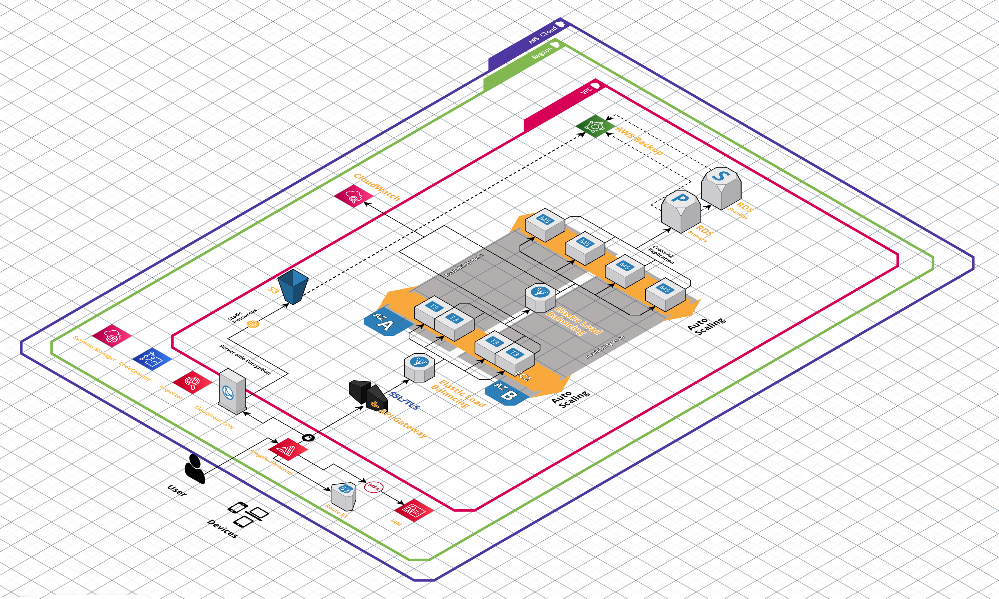
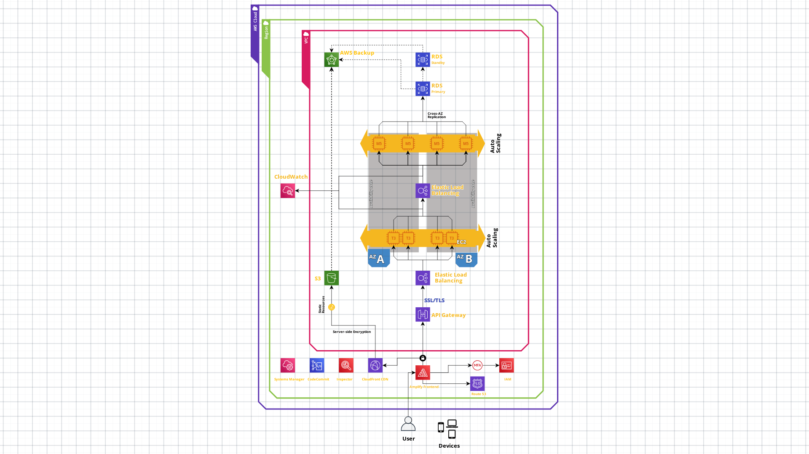

# LocalBazaar Cloud Architecture Specification Document

Welcome to the LocalBazaar Cloud Architecture Specification repository! This document outlines the cloud architecture design for LocalBazaar, a small business marketplace that connects local sellers with buyers. The goal of this specification is to provide a comprehensive overview of the technical infrastructure, components, and deployment strategies employed to ensure the scalability, reliability, and performance of LocalBazaar.

